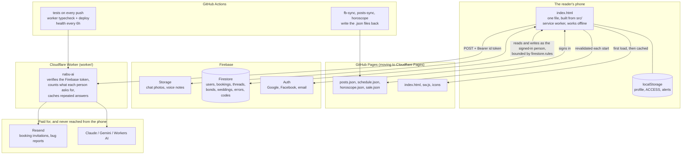

# How Nabu Tarot is put together

One page, so that a new session (or a new person) can see the shape of the
thing before reading any of it.

## The pieces

## Where trust sits, and where it does not

This matters more than the boxes.

- **The bundle is public.** Every lesson, every card meaning and every price is
  inside `index.html`, which anybody can read. Nothing in the app is secret
  because nothing in the app *can* be.
- **`ACCESS` is a cache of the account.** `users/{uid}.access` is the truth,
  written only by Nabu's dashboard and by the worker (a Play purchase, a
  redeemed code); the phone reads it back and never writes it. `ACCESS.has()`
  still reads localStorage, so it decides what the app shows, not what a
  person is able to obtain: binding an unlock to an account stops it being
  *shared*; it does not stop it being *tampered with* on the person's own
  device. Say so plainly when it comes up rather than implying the paywall is
  a lock.
- **Codes are checked by the worker.** The book (`content/codes`) is readable
  by Nabu and the service account only; the phone sends the code to `/redeem`
  with its sign-in, and the worker binds the code to that account.
- **`firestore.rules` is the only real boundary.** Everything the phone does to
  the database, it does as the signed-in person. Whatever the rules permit is
  what the app can do, whoever is driving it. That is why an unpublished rules
  change is a broken feature, and why `isAdmin()` insists on a verified email.
- **The worker holds the keys.** The Anthropic, Gemini and Resend keys live
  there and never reach a browser. Since it also costs money per call, it now
  checks a Firebase ID token before answering and counts what each person asks
  for.
- **The GitHub token is Nabu's own.** It lives in Nabu's browser only, and is
  only used when Firebase is off.

## The build

`src/*.js` and `src/shell.html` are concatenated by `build.py` into a single
committed `index.html`. Order matters — see `SCRIPTS` at the top of `build.py`:
data files before `core.js`, screens before `main.js`.

Two things must move together for a release, and CI checks the second:

- `src/main.js` — `window.APP_VERSION`
- `sw.js` — `const CACHE`

Without the `sw.js` bump the update never reaches an installed phone.

## The globals

`store` (localStorage), `ACCESS` (what is unlocked), `ALERTS` (the bell),
`BE` (Firebase), `LOVE` / `LOVEDB` (the red thread), `WED` (weddings),
`PROFILE`, `CONFIG`, `COURSES`, `T()` (strings for the current language),
`L(obj)` (picks `.vi` / `.en`), `lang`.

## The checks

`test/run.py` serves the repo, opens `test/test.html`, and that page drives the
built `index.html` in an iframe with a stand-in for Firestore. The page posts
its results back to the runner as it goes, so a run that stops half way still
says which check it stopped after.
